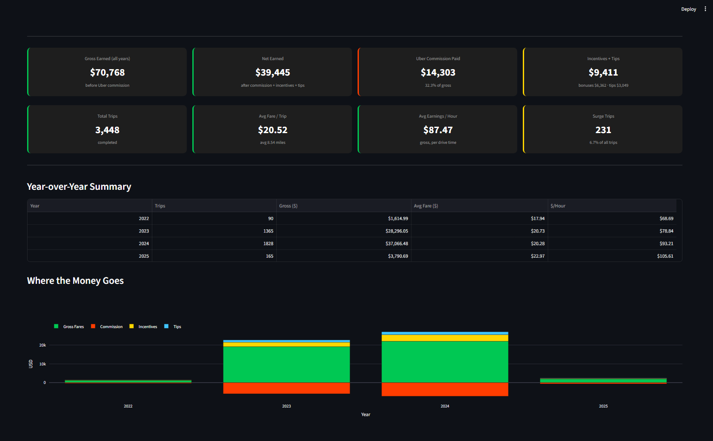
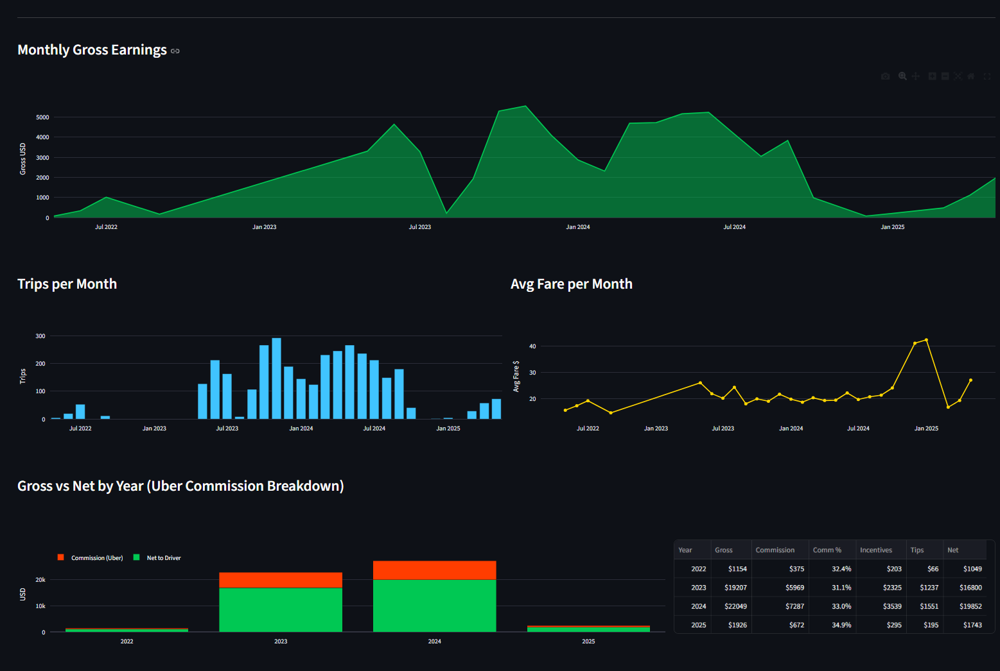
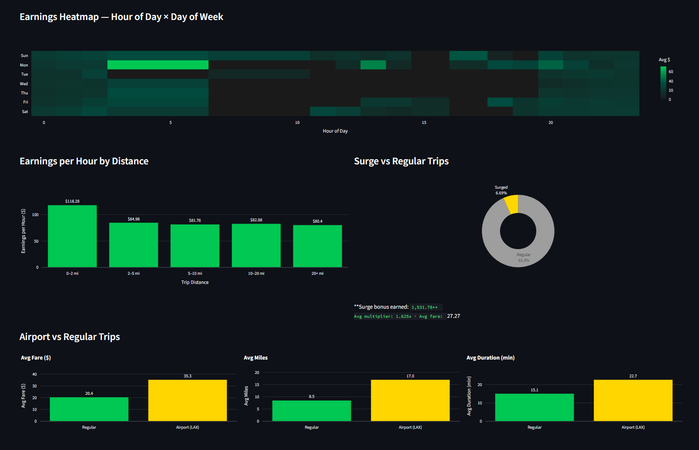
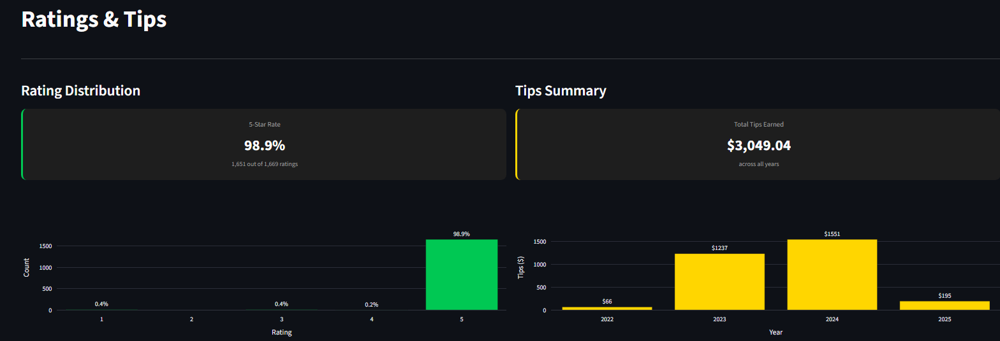

# Uber Driver Analytics Dashboard


Real-world analytics built on **3 years of personal Uber driver data** — 3,448 completed trips across Los Angeles (2022–2025).

> "I analyzed my own business to find where the real money was."

**[Live Demo →](https://uber-driver-analytics.streamlit.app)**

---

## Screenshots









---

## Key Findings

| Metric | Value |
|--------|-------|
| Total gross earned | **$70,768** |
| Net after Uber commission | **$39,445** |
| Uber commission rate | **32.3%** of gross |
| Avg earnings per hour | **$87/hr** gross |
| Best trip type ($/hr) | Short trips 0–2 mi → **$118/hr** |
| 5-star rating rate | **98.9%** (1,669 ratings) |
| Surge bonus earned | **$1,531** across 231 trips (6.7%) |
| Best single day | Oct 28 2023 (Halloween eve) → **$418** |
| $/hr growth 2022→2025 | **$68 → $105** (+54%) |
| Incentives vs commission | Uber took $14,303 · paid back $6,362 (44%) |

---

## Tech Stack

| Layer | Tool |
|-------|------|
| Data source | Uber driver CSV export (personal) |
| Database | Supabase (PostgreSQL cloud) |
| Ingestion | Python + pandas + REST API |
| Dashboard | Streamlit + Plotly |
| Containerization | Docker + Docker Compose |
| Deployment | Streamlit Cloud |

---

## Dashboard Pages

**Overview** — 8 KPI cards + year-over-year table + "Where the Money Goes" stacked bar

**Earnings** — Monthly timeline · Trips per month · Avg fare trend · Commission breakdown by year

**Trips** — Hour × day heatmap · Distance bucket analysis · Surge vs regular · Airport vs regular

**Ratings & Tips** — 5-star distribution · Tips by year

---

## Quick Start

### Option A — Docker (recommended)

```bash
git clone https://github.com/evgenii-matveev/uber-driver-analytics.git
cd uber-driver-analytics
cp .env.example .env        # fill in your Supabase credentials
docker compose up
```
Open **http://localhost:8501**

### Option B — Python

```bash
git clone https://github.com/evgenii-matveev/uber-driver-analytics.git
cd uber-driver-analytics

pip install -r requirements.txt

cp .env.example .env        # fill in your Supabase credentials

python -m streamlit run dashboard/app.py
```

---

## Load Your Own Data

To run this with your own Uber export:

1. **Request your data** at [Uber Help → Request Your Data](https://help.uber.com/driving-and-delivering/article/request-your-data)
2. **Place CSVs** in `data/` folder:
   - `driver_lifetime_trips.csv`
   - `driver_payments.csv`
   - `driver_lifetime_ratings_received.csv`
3. **Create a free Supabase project** at [supabase.com](https://supabase.com)
4. **Run schema** — paste `sql/schema.sql` into Supabase SQL Editor and execute
5. **Load data:**
   ```bash
   python ingestion/load_supabase.py
   ```
6. **Launch dashboard:**
   ```bash
   python -m streamlit run dashboard/app.py
   ```

---

## Project Structure

```
uber-driver-analytics/
├── data/                    # CSVs here (gitignored — personal data)
├── sql/
│   ├── schema.sql           # PostgreSQL table definitions
│   └── analysis/            # 12 analytical SQL scripts
├── ingestion/
│   ├── load_data.py         # CSV → local PostgreSQL pipeline
│   └── load_supabase.py     # CSV → Supabase via REST API
├── dashboard/
│   ├── app.py               # Streamlit app (4 pages)
│   └── db.py                # SQL query layer
├── .streamlit/
│   └── secrets.toml.example
├── Dockerfile
├── docker-compose.yml
├── requirements.txt
└── .env.example
```

---

## Data Schema

| Table | Rows | Description |
|-------|------|-------------|
| `trips` | 3,745 | Every trip — timestamps, fares, distance, flags |
| `payments` | 21,112 | Per-trip payment breakdown by category |
| `ratings` | 1,669 | 5-star ratings received |

---

## Insights That Surprised Me

**Short trips pay more per hour** — 0–2 mile trips earn $118/hr vs $80/hr for 20+ mile trips. Uber's minimum fare kicks in, and you fit more trips per hour.

**Halloween weekend > New Year's** — Oct 28 2023 was the single best day ($418, 10 surge trips). Jan 1 had the highest avg fare ($45/trip) but fewer trips.

**Incentives recovered 44% of commission** — Uber took $14,303 in commission but paid back $6,362 in driver incentives. Net commission burden: ~18%.

**$/hr grew 54% in 3 years** — from $68/hr in 2022 to $105/hr in 2025, while avg trip distance dropped (shorter trips, smarter routing).

---

## Skills Demonstrated

- **SQL** — window functions, CTEs, date/timezone handling, aggregations
- **Data Engineering** — CSV ingestion pipeline, schema design, indexing strategy
- **Analytics** — cohort analysis (year-over-year), segmentation (distance buckets, surge/regular)
- **Visualization** — Streamlit multi-page app, Plotly heatmaps, area charts, donut charts
- **DevOps** — Docker containerization, Supabase cloud DB, environment secrets management

---

*Data: personal Uber driver export · Los Angeles, CA · May 2022 – May 2025*
