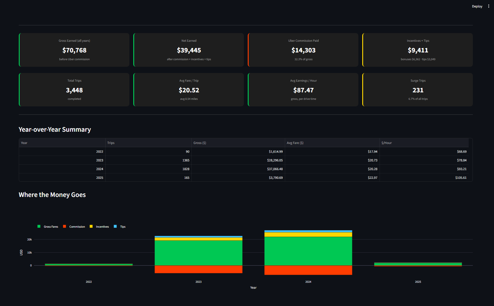
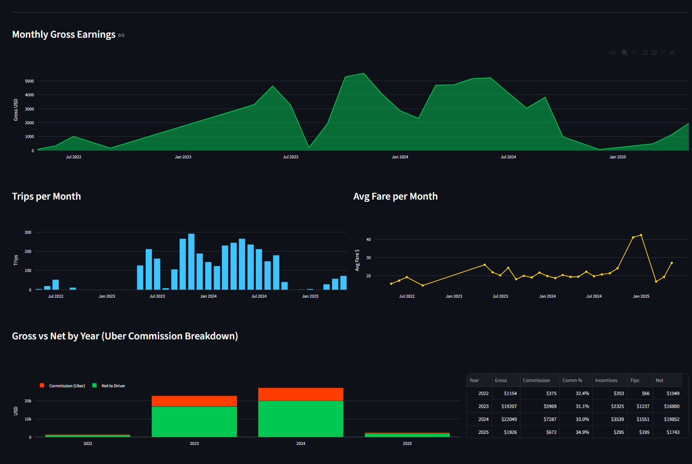
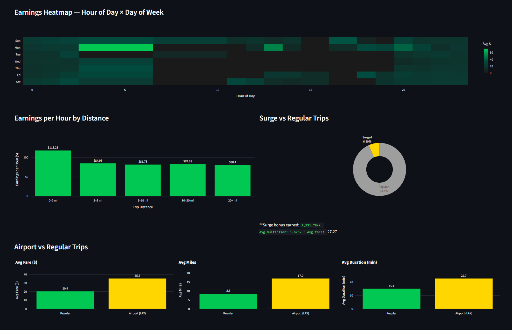
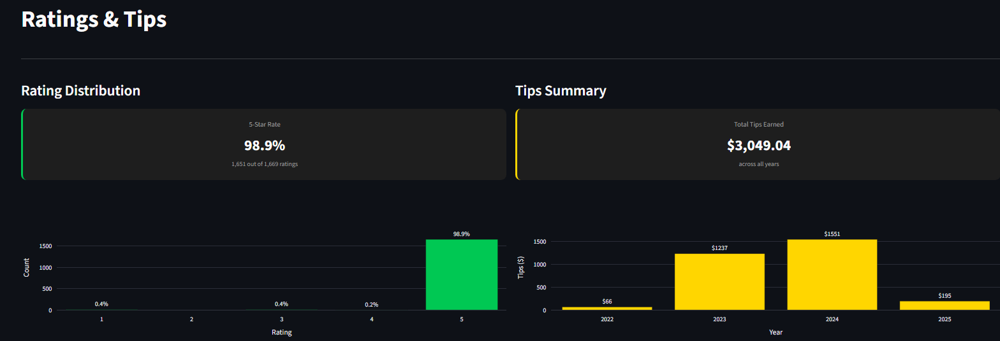

# I Drove Uber for 3 Years. Then I Analyzed It.


[](https://evgeniimatveevusa-uber-driver-analytics.hf.space)


**3,448 trips. $70,768 earned. $31,323 taken by Uber. One question: where was the real money?**

**[Live Demo → HuggingFace Spaces](https://evgeniimatveevusa-uber-driver-analytics.hf.space)**

---

## The Story

From May 2022 to May 2025, I drove Uber full-time across Los Angeles while building my data engineering skills on the side. Every trip, every surge, every 5-star rating — all logged by Uber's system.

At some point I realized: I was sitting on 3 years of personal business data and had never actually analyzed it. So I requested my full export, built an ingestion pipeline, modeled it in PostgreSQL, and turned it into a dashboard. What I found surprised me.

---

## What I Found

**Short trips pay more than long ones** — 0–2 mile trips average $118/hr. Trips over 20 miles drop to $80/hr. Uber's minimum fare kicks in on shorts, and you fit more of them per hour. Counterintuitive until you do the math.

**Halloween > New Year's Eve** — October 28, 2023 was my single best day: $418, 10 surge trips. January 1st had the highest avg fare per trip ($45) but fewer trips overall. Event volume beats event pricing.

**Uber took $14,303 in commission — then paid back $6,362 in incentives** — net commission burden after incentives: ~18%, not the 32.3% gross rate. The incentive programs partially offset what looks like an aggressive take rate.

**I earned 54% more per hour in 2025 than 2022** — $68/hr → $105/hr, while avg trip distance dropped. Shorter trips, smarter routing, better surge timing.

**98.9% of my ratings were 5-star** — 1,669 rated trips, 1,651 at 5 stars. Not a vanity metric — high ratings unlock better surge zones and priority dispatch in LA.

---

## The Numbers

| Metric | Value |
|--------|-------|
| Total gross earned | **$70,768** |
| Net after commission | **$39,445** |
| Uber's gross take rate | **32.3%** |
| Net take rate (after incentives) | **~18%** |
| Avg earnings per hour | **$87/hr gross** |
| Best trip type | Short 0–2 mi → **$118/hr** |
| 5-star rating rate | **98.9%** (1,669 ratings) |
| Surge trips | **231 trips · $1,531 earned** |
| Best single day | **Oct 28 2023 → $418** |
| $/hr growth 2022–2025 | **$68 → $105 (+54%)** |

---

## Screenshots

<details>
<summary>📊 Overview — KPI Cards & Year-over-Year</summary>



</details>

<details>
<summary>💰 Earnings — Monthly Timeline & Commission Breakdown</summary>



</details>

<details>
<summary>🗺️ Trips — Heatmap, Distance & Surge Analysis</summary>



</details>

<details>
<summary>⭐ Ratings & Tips — Distribution & Tips by Year</summary>



</details>

---

## How It Works

```
Uber CSV export (3 files · personal data)
        ↓  Python ingestion
   Supabase (PostgreSQL cloud)
        ↓  SQL query layer (12 analytical scripts)
   Dashboard (4 pages · Plotly)
        ↓  Docker
   HuggingFace Spaces (always-on)
```

| Layer | Tool |
|-------|------|
| Data source | Uber driver CSV export (personal) |
| Database | Supabase (PostgreSQL cloud) |
| Ingestion | Python + pandas + REST API |
| Analytics | 12 SQL scripts — window functions, CTEs, cohort analysis |
| Dashboard | Streamlit + Plotly |
| Containerization | Docker + Docker Compose |
| Deployment | HuggingFace Spaces (Docker SDK) |

---

## Dashboard Pages

**Overview** — 8 KPI cards · year-over-year comparison · "Where the Money Goes" stacked bar

**Earnings** — Monthly gross/net timeline · trips per month · avg fare trend · commission breakdown by year

**Trips** — Hour × weekday heatmap · distance bucket analysis ($/hr by range) · surge vs regular · airport vs regular

**Ratings & Tips** — 5-star distribution · tips by year

---

## Quick Start

### Option A — Docker

```bash
git clone https://github.com/evgeniimatveev/uber-driver-analytics.git
cd uber-driver-analytics
cp .env.example .env        # fill in your Supabase credentials
docker compose up
```
Open **http://localhost:8501**

### Option B — Python

```bash
git clone https://github.com/evgeniimatveev/uber-driver-analytics.git
cd uber-driver-analytics
pip install -r requirements.txt
cp .env.example .env
python -m streamlit run dashboard/app.py
```

---

## Run It With Your Own Data

Uber drivers can export their full trip history at [Uber Help → Request Your Data](https://help.uber.com/driving-and-delivering/article/request-your-data).

1. Place the 3 CSVs in `data/`:
   - `driver_lifetime_trips.csv`
   - `driver_payments.csv`
   - `driver_lifetime_ratings_received.csv`
2. Create a free project at [supabase.com](https://supabase.com)
3. Run `sql/schema.sql` in Supabase SQL Editor
4. Load data: `python ingestion/load_supabase.py`
5. Launch: `python -m streamlit run dashboard/app.py`

---

## Project Structure

```
uber-driver-analytics/
├── data/                    # CSVs here (gitignored — personal data)
├── sql/
│   ├── schema.sql           # PostgreSQL table definitions
│   └── analysis/            # 12 analytical SQL scripts
├── ingestion/
│   ├── load_data.py         # CSV → local PostgreSQL
│   └── load_supabase.py     # CSV → Supabase via REST API
├── dashboard/
│   ├── app.py               # Streamlit app (4 pages)
│   └── db.py                # SQL query layer
├── Dockerfile
├── docker-compose.yml
├── requirements.txt
└── .env.example
```

---

## Data Schema

| Table | Rows | Description |
|-------|------|-------------|
| `trips` | 3,745 | Every trip — timestamps, fares, distance, surge flag |
| `payments` | 21,112 | Per-trip payment breakdown by category |
| `ratings` | 1,669 | 5-star ratings received |

---

## Availability

| Layer | Detail |
|-------|--------|
| Hosting | HuggingFace Spaces (Docker SDK) |
| Uptime | 24/7 — HF Spaces does not sleep |
| Database | Supabase (PostgreSQL) via HF Space secrets |
| Keepalive | GitHub Actions every 30 min · cron-job.org backup |
---

*Personal Uber driver data · Los Angeles, CA · May 2022 – May 2025 · Built by Evgenii Matveev*
